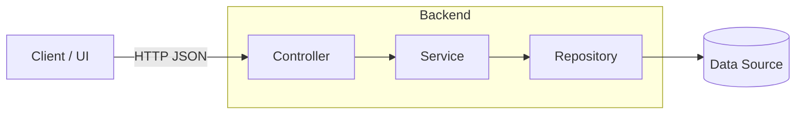
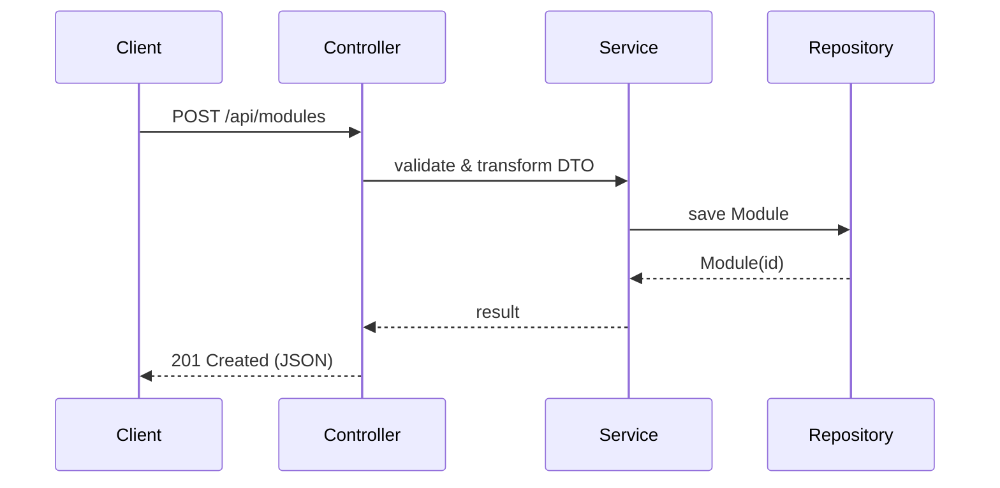

## THM Modulmanager

A lightweight module planner for THM students — Spring Boot (Groovy) REST backend with Gradle.


---

### Why this exists
Plan and validate study modules, keep track of credits across pools, and prepare for graduation checks. Designed around a clean layered architecture (controller → service → repo) for easy evolution.

---

## Tech stack
- **Language**: Groovy (JVM), Java 21 toolchain
- **Framework**: Spring Boot (Web, DevTools)
- **Build**: Gradle (Groovy DSL)
- **Tests**: JUnit Platform

## Getting started
- **Prerequisites**:
  - JDK 21
  - Git

- **Run locally**:
  ```bash
  ./gradlew bootRun
  ```
  Server starts on `http://localhost:8080`.

- **Run tests**:
  ```bash
  ./gradlew test
  ```

- **Build JAR**:
  ```bash
  ./gradlew build
  ```
  Artifact at `build/libs/`.

## Project layout
```text
src/main/groovy/de/thm/modulmanager
├── app/          # Application-level config & bootstrapping
├── controller/   # REST controllers
├── domain/       # Entities, enums, value objects
├── repo/         # Repository interfaces/impls
└── service/      # Business logic
```
Key files:
- `src/main/groovy/de/thm/modulmanager/ThmModulmanagerApplication.groovy`
- `src/main/resources/application.properties`
- `build.gradle`

---

## Architecture overview


### Request lifecycle (example)


## Domain model
```mermaid
classDiagram
  direction LR

  class Student {
    +studentId: UUID
    +firstName: String
    +lastName: String
    +studentNumber: int
    +vertiefung: Vertiefung
  }

  class StudyPlan {
    +planId: UUID
    +calculateCrpByPool(): Map<Pool,int>
    +calculateSwsBySemester(): Map<int,int>
    +validate(): ValidationResult
  }

  class Module {
    +moduleId: UUID
    +moduleName: String
    +moduleNumber: int
    +moduleCredits: int  // CrP
    +moduleWeight: boolean
    +modulePool: Pool
    +moduleSemester: int // 0..10
    +moduleGrade: int
    +vertiefung: Vertiefung? // only if Pool=Vertiefungspool
  }

  enum Pool {
    Vertiefungspool
    Wahlpflichtpool
    Ueberfachlicherpool
  }

  enum Vertiefung {
    Medien
    BWL
    Informatik
  }

  class PoolRules <<policy>> {
    +minCrp(pool:Pool): int
    +maxCrp(pool:Pool): int
  }

  class ValidationResult {
    +valid: boolean
    +messages: List<String>
  }

  Student "1" --> "1" StudyPlan
  StudyPlan "1" *-- "*" Module
  StudyPlan ..> PoolRules : uses
  Module --> Pool
  Module ..> Vertiefung : optional
```

### Validation flow
```mermaid
flowchart TD
  A[StudyPlan] --> B{Pools \n(Wahlpflicht/Überfachlich)}
  B -->|sum CrP| C[Check budgets]
  C -->|OK| D[Compute SWS 3–5]
  C -->|Fail| X[ValidationResult.invalid]
  D --> E{Vertiefung chosen?}
  E -->|Yes| F[GEN1002 + GEN1003 present]
  F -->|OK| G[ValidationResult.valid]
  F -->|Missing| X
  E -->|No| X
```

---

## API sketch (evolving)
- `GET /api/modules` — list modules
- `POST /api/modules` — create module
- `GET /api/modules/{id}` — fetch module
- `PUT /api/modules/{id}` — update module
- `DELETE /api/modules/{id}` — remove module

Note: Endpoints will appear under `controller` as they are implemented.

## Configuration
- `application.properties`
  - `spring.application.name=thm-modulmanager`

## Contributing
- Use clear commit messages and conventional, readable code
- Prefer small, focused pull requests
- Add/adjust tests for behavior changes

## License
Choose an OSS license and add a `LICENSE` file (e.g., MIT or Apache-2.0).